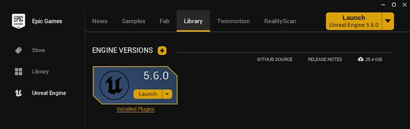
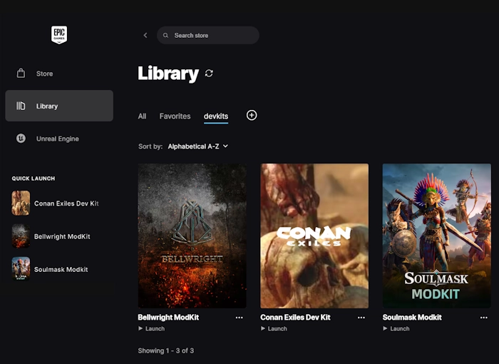

# Unreal Engine

Contents ...

- ue : Unreal Engine
- ue4ss : Unreal Engine 4/5 Scripting System
- bw : Bellwright
- ce : Conan Exiles, by Funcom
- es4r : Elder Scrolls IV Oblivion Remastered, by Bethesda
- sm : Soulmask, by CampFire

## Tools

### Unreal Engine

- Install the devkit corresponding to your game version.
- It's expected (and therefore safe) that you may install >1 side-by-side.

### Unreal Engine 4/5 Scripting System (UE4SS)

- A community script extender for Lua and C++. Base version maintained on GitHub.
- Most often requires some porting effort to work for each specific game.

## ModKits

### Bellwright

- Unreal Engine : Official modkit is built on UE `5.5`. Download @ Epic Games Store.

### Conan Exiles

- Unreal Engine : Official modkit is built on UE `4.15`. Download @ Epic Games Store.

### Elder Scrolls IV Oblivion Remastered

- Unreal Engine : No official modkit. Game is built on UE `5.3`. Download @ Epic Games Store.
- Unreal Engine 4/5 Scripting System (UE4SS) : Download Oblivion Remastered port @ Nexus Mods.

### Soulmask

- Unreal Engine : Official modkit is built on UE `4.27`. Download @ Epic Games Store.
